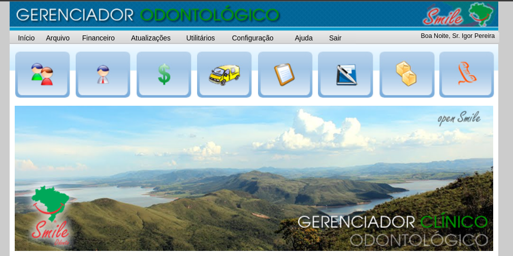

# GCO - Gerenciador para **C**onsultório **O**dontológico

## Descrição

O GCO (Gestão de Consultório Odontológico) é uma solução de software de código aberto que foi descontinuada em meados de 2015 pelos seus idealizadores e desenvolvedores. Foi projetada para atender às necessidades específicas de um consultório odontológico e, embora não seja mais mantida, ainda é utilizada em alguns consultórios no Brasil por ser uma solução de código aberto sem custos e licenças a pagar. Seu principal objetivo é aumentar a eficiência dos serviços prestados, garantindo ao mesmo tempo maior segurança e confiabilidade das informações armazenadas. O sistema automatizava a gestão das diversas atividades do consultório, incluindo:

- Cadastro de pacientes
- Cadastro de funcionários, prestadores de serviços e fornecedores
- Tabela de serviços oferecidos
- Listagem de dentistas por especialidade
- Gerenciamento de convênios e produtos fornecidos
- Planejamento e emissão de orçamentos por paciente
- Emissão de receituários e contratos
- Agendamento de consultas

Além disso, o GCO oferece a geração de relatórios detalhados sobre os serviços prestados e atendimentos realizados. Atualmente, neste repositório, o sistema está passando por melhorias contínuas em suas funcionalidades, interface e desempenho, incluindo correções de bugs e atualizações para as versões mais recentes do PHP. A aplicação é executada em um servidor Apache no XAMPP, utilizando versões do PHP 5.2.

